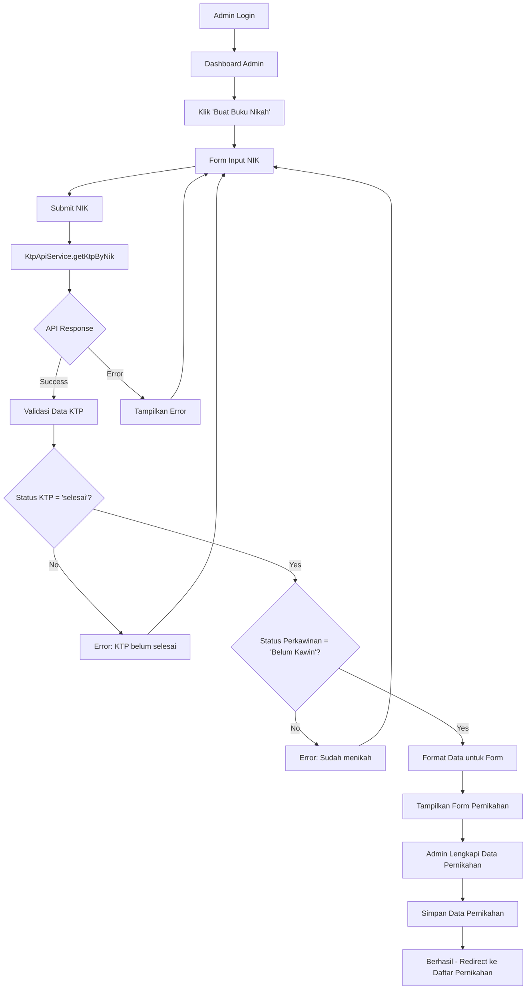
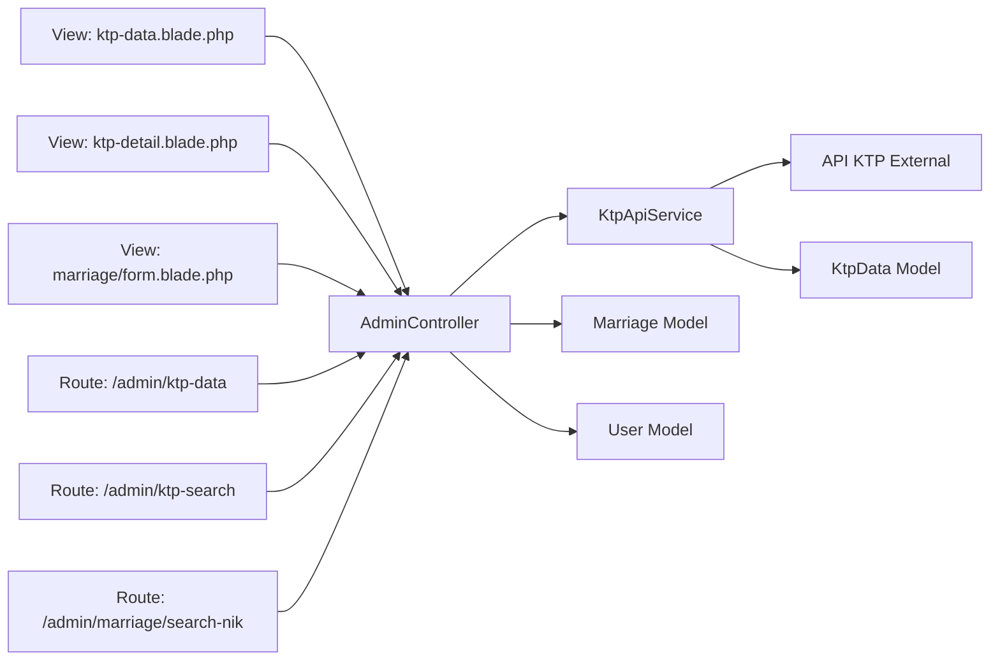
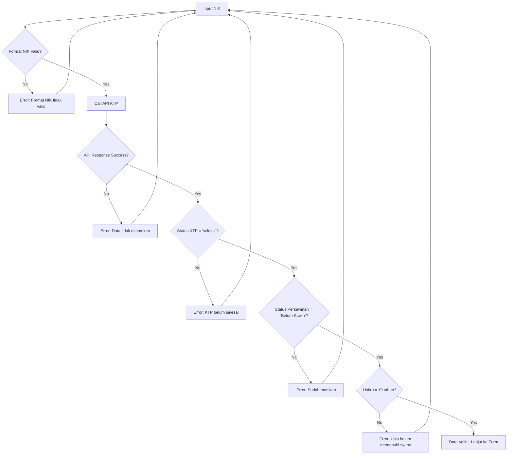
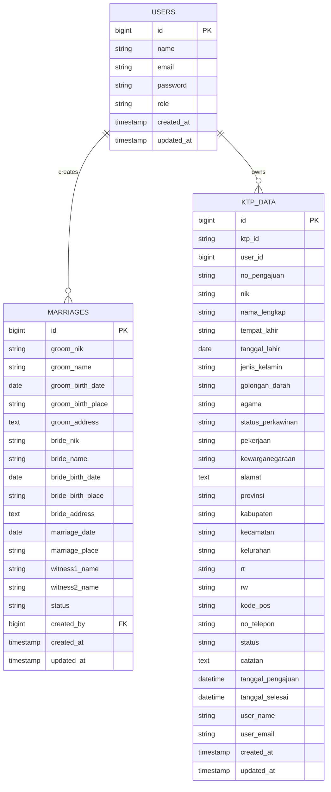
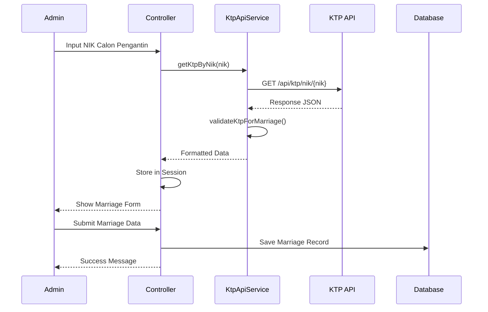
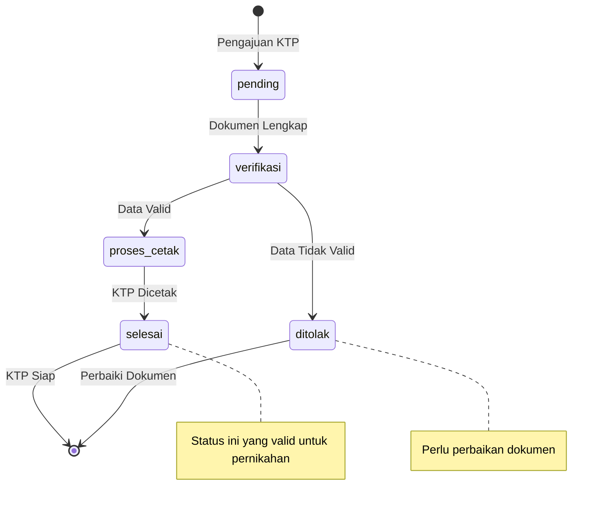
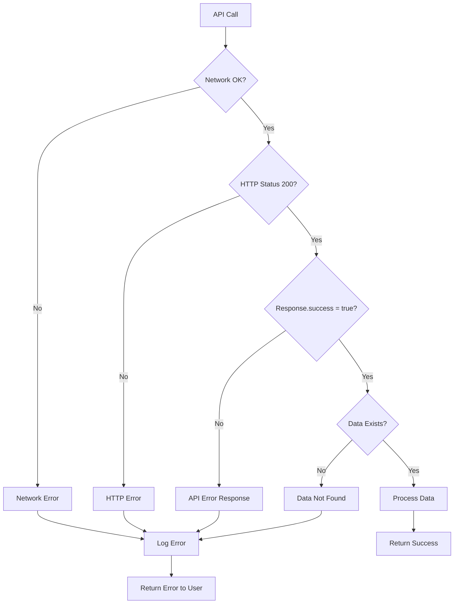

# Alur Integrasi API KTP

## Diagram Alur Sistem

## Diagram Komponen Sistem

## Diagram Validasi Data

## Diagram Database Schema

## Diagram API Integration

## Status Flow KTP

## Error Handling Flow

